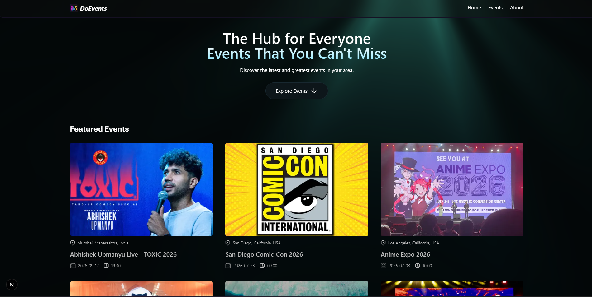
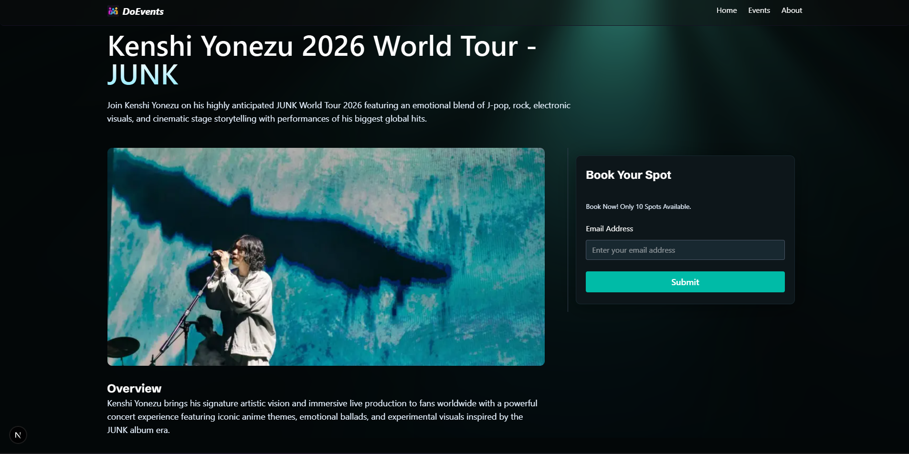

# DoEvents

DoEvents is a modern Next.js application for discovering events, viewing details, and managing bookings with a MongoDB-backed full-stack architecture.

## Project Preview





## What This Project Includes

- Next.js App Router structure with server and client components
- MongoDB integration for events and bookings
- API routes under `app/api/events` and `app/api/bookings`
- Reusable UI components in `components/`
- Styles scoped through CSS Modules
- Event detail pages with booking workflows

## Step-by-Step Setup

### 1. Clone the repository

```bash
git clone <repo-url>
cd "DoEvents"
```

### 2. Install dependencies

```bash
npm install
```

Or with alternative package managers:

```bash
yarn install
pnpm install
```

### 3. Configure MongoDB

1. Create a MongoDB cluster or start a local MongoDB instance.
2. Add a `.env` file at the project root.
3. Set the MongoDB connection string for the app.

Example `.env`:

```env
MONGODB_URI="your-mongodb-connection-string"
```

Confirm the connection variable matches the usage in `lib/mongodb.ts`.

### 4. Run the development server

```bash
npm run dev
```

Open [http://localhost:3000](http://localhost:3000) in your browser.

### 5. Explore the app

- Home page: browse events
- Event detail pages: view event data and booking options
- Booking API: inspect `app/api/bookings/[slug]/route.ts`
- Event API: inspect `app/api/events/route.ts`

## Useful Commands

```bash
npm run dev      # Start development server
npm run build    # Build for production
npm run start    # Run production build
npm run lint     # Run lint checks if configured
```

## Folder Structure

- `app/` — pages, layouts, and API routes
- `components/` — reusable UI components and styles
- `database/` — database models and data helpers
- `lib/` — utility functions, actions, and DB connection
- `preview/` — screenshot assets used in this README
- `public/` — public images and icons

## Deploying

Deploy to Vercel or any platform that supports Next.js. Make sure environment variables are configured in production.

## Learn More

- [Next.js Documentation](https://nextjs.org/docs)
- [MongoDB Node.js Driver](https://www.mongodb.com/docs/drivers/node)

---

Happy building! Customize the event flow, add more events, or connect booking data to a real backend for a complete production-ready experience.
